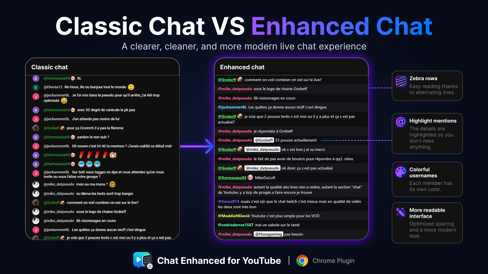
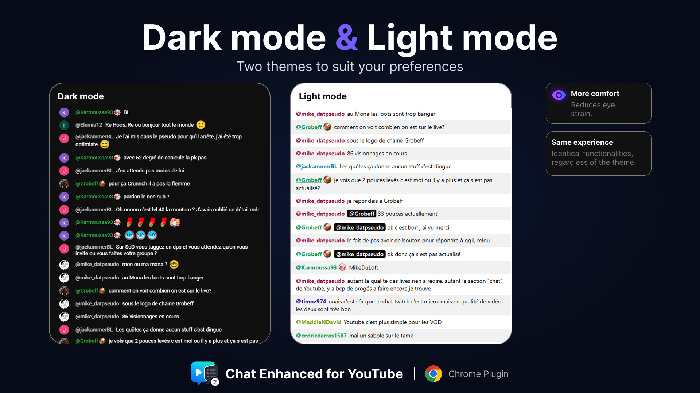
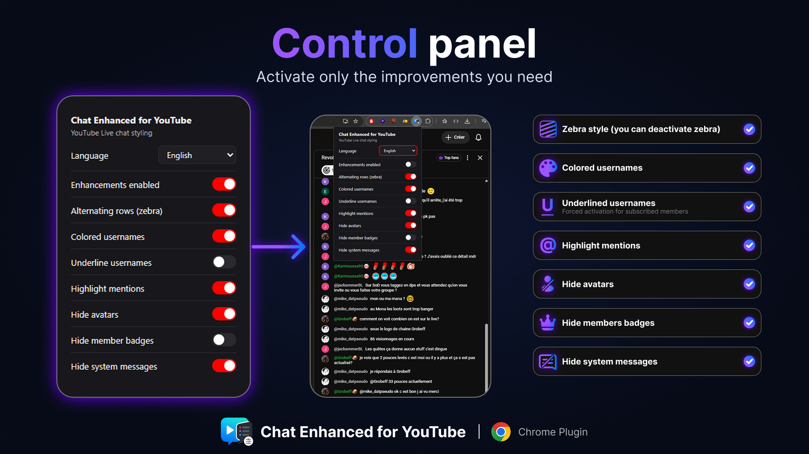
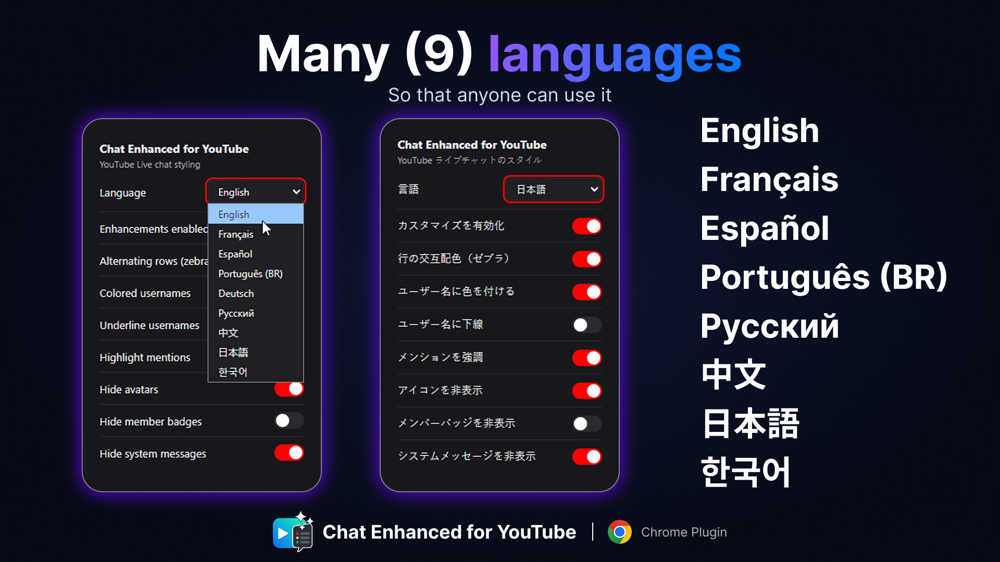
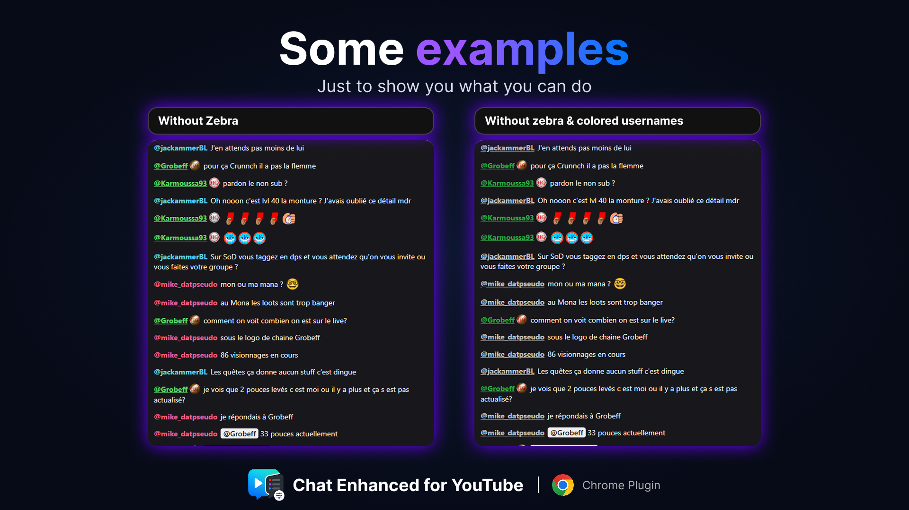
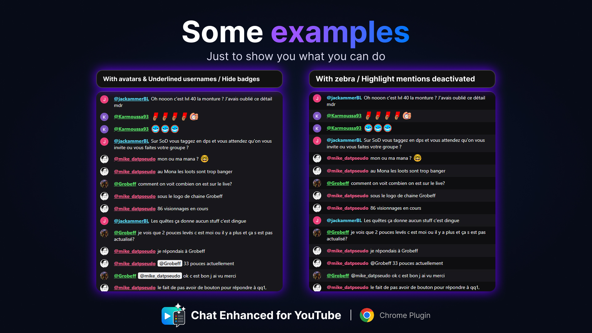

# Chat Enhanced for YouTube

A small Chrome (Manifest V3) extension that restyles the **YouTube Live chat** to
make it easier to read: compact, dark, dense, no avatars, colored usernames, less
noise — fully configurable from a control panel.

> Not affiliated with YouTube or Google.

## Features

- **Compact, dense layout** — more messages on screen, less padding and noise.
- **Colored usernames** — each author gets a consistent color during the chat
  session, so you recognize people at a glance.
- **Density presets** — switch between comfortable, compact, and ultra-compact
  layouts without tuning individual values.
- **Focused mentions** — highlight only mentions addressed to you, all mentions,
  or none.
- **Dark mode aware** — follows YouTube's light/dark theme.
- **Per-feature toggles** — turn individual tweaks on or off (zebra rows, colored
  usernames, avatars, member badges, system messages) from a popup.
- **Multilingual interface** — the control panel is localized.

### Dark mode

### Control panel

Click the extension icon to open the control panel and toggle each feature live —
changes apply instantly, no page reload.

### Languages

### More examples

## How it works

The live chat is served at its own URL (`youtube.com/live_chat`) and embedded as
an iframe on the watch page (and as a top-level page in popout mode). A single
content script is injected there:

- **`src/content/chat.css`** — does ~90% of the work in pure CSS. Pure CSS is
  robust against YouTube recycling chat DOM nodes and costs nothing at runtime.
- **`src/content/chat.ts`** — assigns session-stable username colors, detects
  selected mentions, and handles YouTube's recycled chat renderers.

Selectors target stable custom-element tags (`yt-live-chat-*-renderer`) and
stable internal IDs (`#author-name`, `#message`…), never YouTube's generated
utility classes.

Settings live in `chrome.storage.sync`; the content script mirrors them onto
`<html>` as attributes and chat.css gates each feature on them, so changes apply
live without reloading the page. See `src/settings.ts`, `src/popup/`.

## Privacy

The extension developer collects no personal data and the extension contacts no
external server. Author names and visible message text are processed only inside
the open chat page to assign colors and detect mentions; they are never stored or
transmitted. Only your preferences are saved through the browser's sync storage.
Full details are in [PRIVACY.md](PRIVACY.md).

## License

Released under the MIT License — see [LICENSE](LICENSE).
